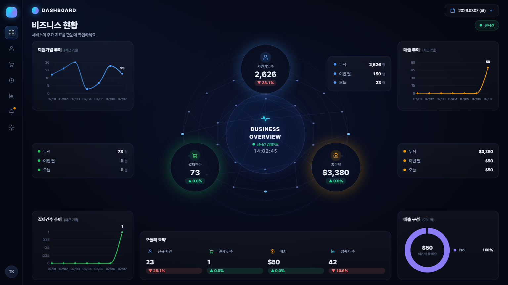

# TAAS 비즈니스 현황 대시보드

TAAS(Trade As A Service) 서비스의 핵심 지표를 한 화면에서 실시간으로 보여주는 관리자 대시보드.
회원가입 · 결제 · 매출 · 접속자 지표를 30초마다 갱신하며, 스크롤 없이 한 화면에 담긴다.



---

## 주요 기능

- **오비탈 허브 레이아웃** — 중앙 실시간 시계 + 회원가입수/결제건수/총수익 노드
- **핵심 지표** — 누적 / 이번 달 / 오늘 + 전일 대비 증감률(▲▼)
- **추이 그래프(최근 7일)** — 회원가입 · 매출 · 결제건수
- **매출 구성 도넛** — 이번 달 등급(grade)별 매출 비중
- **오늘의 요약** — 신규회원 · 결제건수 · 매출 · 접속자수
- **실시간 폴링** — 30초 주기 자동 갱신(SWR), 서버 시각 기준 시계
- **스크롤 없는 화면 맞춤** — 고정 설계(1600×900)를 뷰포트에 스케일(16:9 꽉 참)

---

## 기술 스택

| 영역 | 사용 |
|---|---|
| 프레임워크 | Next.js 14 (App Router) · React 18 · TypeScript |
| 데이터 | MariaDB 직접 조회 (`mysql2`, 서버 사이드 Route Handler) |
| 차트 | Recharts |
| 폴링/상태 | SWR |
| 스타일 | CSS Modules (다크 네온 테마) |

> 별도 백엔드 서버 없음 — Next.js Route Handler가 서버 사이드에서 DB를 직접 집계한다.

---

## 아키텍처

```
[브라우저] --폴링(30s)--> [Next.js Route Handler] --SQL--> [MariaDB(taas-v2)]
                          /api/dashboard/overview
```

DB는 **AWS RDS(외부 비공개)**. 사내 **중앙 호스트(192.168.0.12)** 한 대가 SSH 터널을 유지하고,
각 PC는 그 호스트(`DB_HOST`)로 붙는다. → PC마다 터널 세팅 불필요.
자세한 내용은 **[docs/team-db-access.md](docs/team-db-access.md)**.

### 문서 (docs/)

| 문서 | 내용 |
|---|---|
| **[db-schema.md](docs/db-schema.md)** | DB 테이블·컬럼·enum·등급값 (실 DB 추출) — **쿼리 작업 시 필독** |
| [dashboard-spec.md](docs/dashboard-spec.md) | 지표↔스키마 매핑 · API 명세 · 결정사항 |
| [team-db-access.md](docs/team-db-access.md) | 내부망 DB 접속(중앙 호스트 터널) |

> 백엔드(TaaS-be)를 열어보지 않아도 위 문서로 스키마를 확인할 수 있다.
> 작업 컨텍스트는 [`CLAUDE.md`](CLAUDE.md)에도 정리되어 있다.

DB 자격증명은 `NEXT_PUBLIC_` 접두사 없이 서버 사이드에서만 사용하며, `import "server-only"`로
클라이언트 번들 유입을 차단한다. → 브라우저에 노출되지 않음.

---

## 시작하기

```bash
git clone https://github.com/Stupic/tradeit-dashboard.git
cd tradeit-dashboard

cp .env.example .env.local     # DB_PASSWORD 실제 값만 채우기 (팀 공유)

npm install
npm run dev                    # http://localhost:3000
```

중앙 호스트(192.168.0.12)의 터널이 떠 있으면 실데이터가 바로 표시된다.

### 환경 변수 (`.env.local`)

| 키 | 설명 | 예시 |
|---|---|---|
| `DB_HOST` | DB 호스트 (팀원=중앙 호스트 IP) | `192.168.0.12` |
| `DB_PORT` | 포트 | `13306` |
| `DB_NAME` | 데이터베이스 | `taas-v2` |
| `DB_USER` / `DB_PASSWORD` | 접속 계정 | (팀 문의) |
| `DB_TIMEZONE` | 집계 기준 타임존 | `+09:00` |

> `.env.local`은 gitignore 처리됨 — 커밋되지 않는다.

---

## API

### `GET /api/dashboard/overview`
대시보드 전체 데이터를 한 번에 반환(폴링 대상).

| 쿼리 | 기본값 | 설명 |
|---|---|---|
| `date` | 오늘(KST) | 기준일 `YYYY-MM-DD` |
| `trendDays` | `7` | 추이 일수 |
| `visitSource` | `CRM` | 방문 집계 대상(`CRM`/`ADMIN`) |

응답은 표준 래퍼 `{ status, code, message, data }`.
`data` 스키마는 [`lib/types.ts`](lib/types.ts) 참고.

- 집계는 네이티브 SQL, "오늘/이번달" 경계는 **KST** 기준
- **`/api/mock/overview`** — 동일 스키마의 목업(오프라인/디자인 확인용)
- 목업으로 보려면 [`lib/useDashboard.ts`](lib/useDashboard.ts)의 `ENDPOINT`를 `/api/mock/overview`로 변경

---

## 프로젝트 구조

```
app/
  page.tsx                       # 대시보드 진입
  api/dashboard/overview/route.ts # 실 DB 집계 엔드포인트
  api/mock/overview/route.ts      # 목업 엔드포인트(폴백)
components/                       # UI (CenterStage, TrendChart, RevenueDonut, ...)
  FitScreen.tsx                   # 뷰포트 맞춤 스케일러
lib/
  db.ts                          # MariaDB 커넥션 풀 (server-only, tz=+09:00)
  dashboard-query.ts             # 집계 SQL → DashboardOverview
  useDashboard.ts                # SWR 폴링 훅
  types.ts                       # 응답 타입
  mock.ts / format.ts
docs/
  dashboard-spec.md              # 지표↔스키마 매핑 · API 명세
  team-db-access.md              # 내부망 DB 접속 가이드
```

---

## 참고 / 미확정

- **통화** — `payment_histories.amount`를 그대로 USD로 표기. 실제 저장 통화가 다르면
  `lib/dashboard-query.ts`의 `currency` 값만 교체.
- **매출 구성** — 현재 스키마상 "단일 결제" 개념이 없어 **등급(grade)별**로 집계.
- **성능** — 폴링 부하가 커지면 서버 캐시/집계 인덱스 추가 검토(자세한 내용 `docs/dashboard-spec.md` §6).
